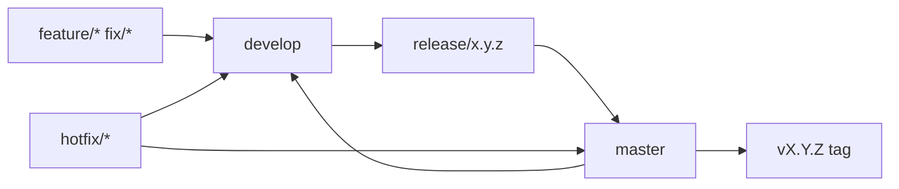

# Workflows

## Branch flow

## CI (pull request)

Workflows under `.github/workflows/` on PRs to `develop` or `master`:

| Workflow | Check name | Role |
| --- | --- | --- |
| `ci.yml` | `PHP plugin` · `MCP server` · `Security (Secrets)` · **`Coverage upload`** | Quality + secret scan; final gate needs the three jobs |
| `e2e.yml` | `Docker WordPress + MCP` | Nightly + `workflow_dispatch` full Compose E2E. **Not** a PR required check. |
| `plugin-e2e.yml` | `WordPress plugin REST` | Live plugin REST against Docker WordPress (no MCP). PR + nightly + `workflow_dispatch`. **Not** in the `Coverage upload` required chain. |
| `commitlint.yml` | `Validate commit messages` | Conventional Commits on every PR commit |
| `semantic-pr.yml` | `Validate PR Title` | PR title type + uppercase subject |
| `scorecard.yml` | Push to `develop`; weekly; manual | OpenSSF Scorecard |

`Coverage upload` is the merge-blocking CI leaf (same pattern as `dto` / `client`). It does not upload Codecov yet; it only succeeds when PHP, MCP, and Gitleaks jobs succeed.

## Local commands

| Command | Purpose |
|---------|---------|
| `make ci` | Full quality gate |
| `make test` | Unit tests only |
| `make integration` | Live stack integration (requires `make up`) |
| `make e2e` | Docker WP + plugin + MCP smoke (all 45 tools). Sets `WP_INTERNAL_URL=http://wordpress` and `E2E_SKIP_PUBLIC_URL=0`. |
| `make e2e-full` | Smoke plus content/featured, media verify (including large JPEG), orphan adopt, resources, site-ops. Nightly / `workflow_dispatch` in `.github/workflows/e2e.yml`. Not a PR required check. |
| `make plugin-e2e` | Docker WordPress + plugin only (no MCP). PHPUnit live HTTP against `/wp-json/chatgpt-connector/v1/`. |

`make up` keeps `http://localhost:8080` and skips public-URL verify so the host admin UI works. E2E does **not** skip that verify. Media suites may fail on current `develop` until upload/adopt/featured product fixes land — that is intentional.
| `make plugin-release` | Build `build/wordpress-chatgpt-<version>.zip` (version read from the plugin header) |
| `tools/install-git-hooks` | Install CaptainHook hooks (Docker) |

## Release (v1.0.0+)

1. Cut `release/x.y.z` from `develop`
2. Update CHANGELOG version section
3. PR to `master`; CI must be green
4. Tag `vx.y.z` on `master`
5. PR merge `master` → `develop`

## Docker services (dev)

| Service | Image |
|---------|-------|
| db | `mariadb:11.4.13` |
| wordpress | `wordpress:php8.3-apache` |
| php (tooling) | `php:8.3-cli-bookworm` (`jooservices/wordpress-mcp-plugin:php83`) |
| mcp | built from `packages/mcp-server` (Node 24) |

Production MCP-only stack: `docker-compose.prod.yml` + `.env.prod`.
