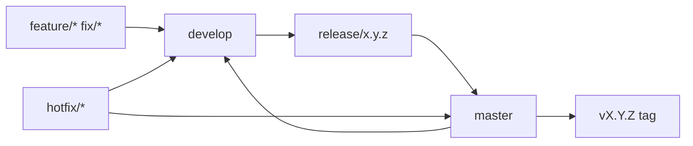

# Workflows

## Branch flow

## CI (pull request)

`.github/workflows/ci.yml` on every PR to `develop` or `master`:

1. Build PHP tooling image
2. `composer ci` — Pint, PHPCS, PHPStan, PHPUnit with coverage floor
3. MCP server — `npm run ci` (TypeScript build + Vitest)

## Local commands

| Command | Purpose |
|---------|---------|
| `make ci` | Full quality gate |
| `make test` | Unit tests only |
| `make integration` | Live stack integration (requires `make up`) |
| `make plugin-release` | Build `build/wordpress-chatgpt-1.0.0.zip` |

## Release (v1.0.0+)

1. Cut `release/1.0.0` from `develop`
2. Update CHANGELOG version section
3. PR to `master`; CI must be green
4. Tag `v1.0.0` on `master`
5. PR merge `master` → `develop`

## Docker services (dev)

| Service | Image |
|---------|-------|
| db | `mariadb:11.4.13` |
| wordpress | `wordpress:php8.3-apache` |
| mcp | built from `packages/mcp-server` |

Production MCP-only stack: `docker-compose.prod.yml` + `.env.prod`.
